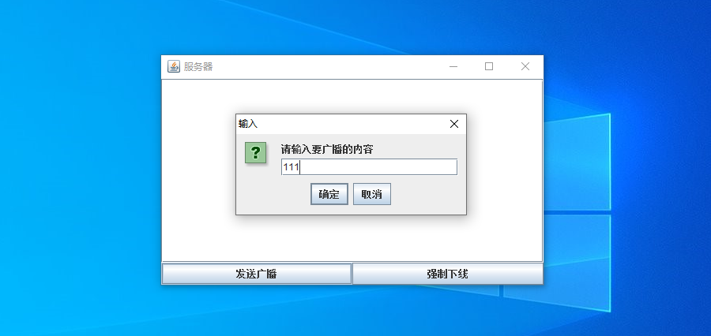
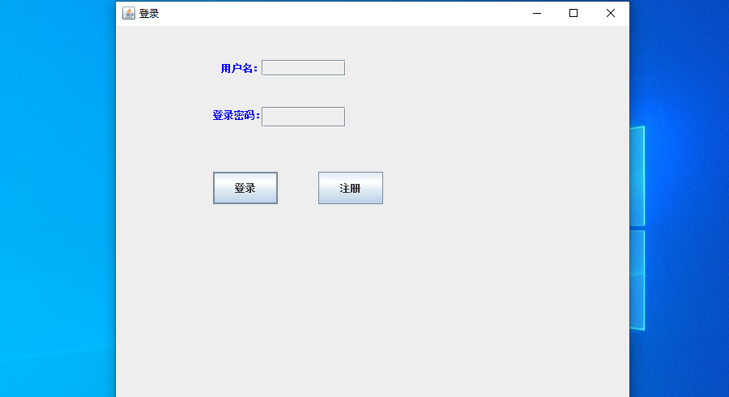
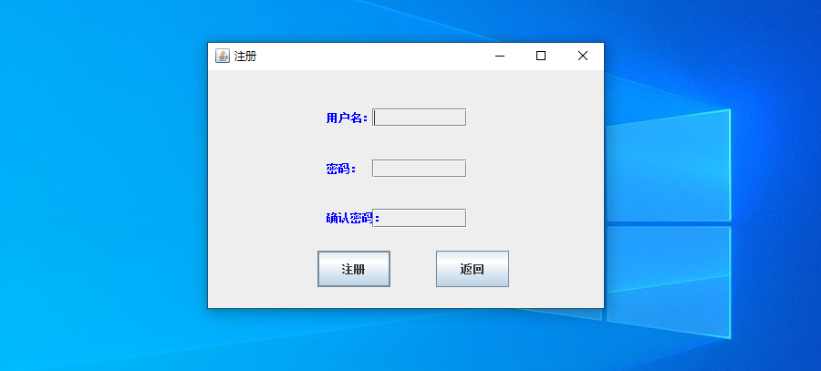
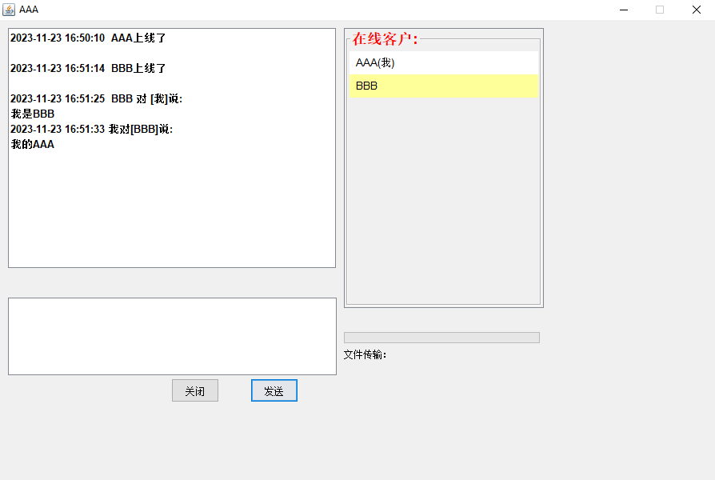
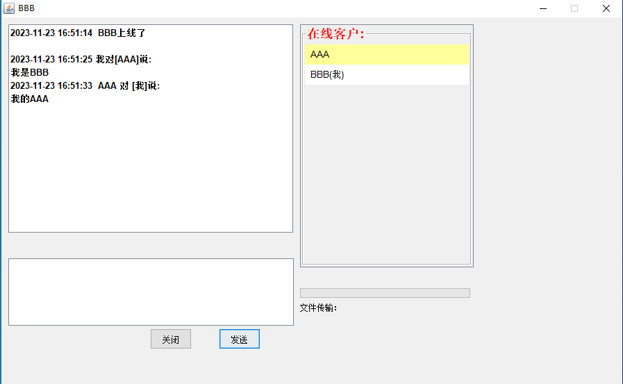

<h1 align="center">28.基于java的聊天室</h1>

- <b>完整代码获取地址：从戎源码网 ([https://armycodes.com/](https://armycodes.com/))</b>
- <b>技术探讨、资料分享，请加QQ群：692619798</b> 
- <b>作者微信：19941326836  QQ：952045282</b> 
- <b>承接计算机毕业设计、Java毕业设计、Python毕业设计、深度学习、机器学习</b>
- <b>选题+开题报告+任务书+程序定制+安装调试+论文+答辩ppt 一条龙服务</b>
- <b>所有选题地址 ([https://github.com/YuLin-Coder/AllProjectCatalog](https://github.com/YuLin-Coder/AllProjectCatalog)) </b>

## 项目介绍

基于java的聊天室：简单的聊天室学习案例，模拟服务端和两个客户端，客户端A和客户端B可以互相收发消息，服务端有广播和强制下线功能

## 环境

- <b>IntelliJ IDEA 2009.3</b>

- <b>JDK 1.8</b>

## 运行截图

